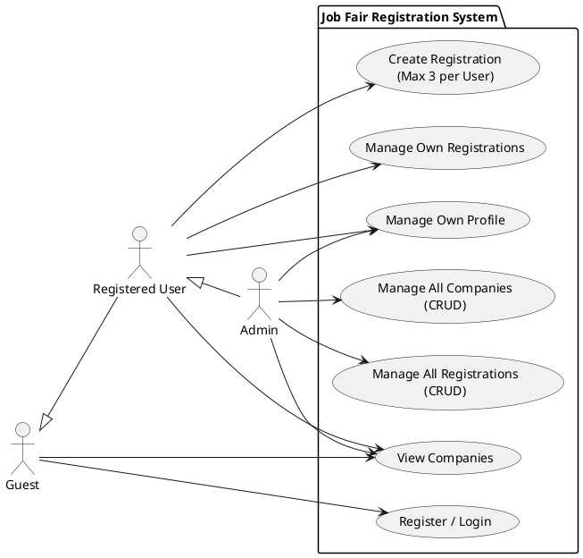

# Online Job Fair Registration API - Intro Presentation

## 1. Project Overview
The **Online Job Fair Registration API** is a backend system designed to manage registrations for an upcoming job fair. It allows users to browse participating companies and schedule interviews/registrations within a specific timeframe.

---

## 2. System Actors
We have identified three primary actors in the system:

*   **Guest (Unauthenticated User):** Can browse companies and create an account.
*   **Registered User:** A job seeker who can manage their profile and register for up to 3 company interviews.
*   **Admin:** A system administrator who can manage all companies and registrations.

---

## 3. Use Case Diagram
The following diagram illustrates the interactions between the actors and the system's core functionalities.

---

## 4. Key Use Cases Breakdown

### A. Authentication & User Management
*   **Register/Login:** Users must be authenticated to perform registration actions.
*   **Profile Management:** Users can view their own details via the `/me` endpoint.

### B. Company Management
*   **Public Access:** Anyone can view the list of companies participating in the job fair.
*   **Admin Control:** Only Admins can add, update, or remove companies from the system.

### C. Registration Workflow
*   **Self-Service:** Users can book interviews with companies.
*   **Constraint Enforcement:** The system automatically prevents a user from registering for more than 3 companies.
*   **Data Integrity:** Admins have full visibility and control over all registrations for reporting and logistical purposes.

---

## 5. Technology Stack
*   **Backend:** Node.js & Express
*   **Database:** MongoDB with Mongoose
*   **Security:** 
    *   JWT Authentication & Password Hashing (bcryptjs)
    *   **Helmet & HPP:** Security headers & HTTP parameter pollution protection
    *   **Rate Limiting:** Protects against brute-force attacks
    *   **CORS:** Cross-Origin Resource Sharing enabled
    *   **Data Sanitization:** express-mongo-sanitize & express-xss-sanitizer
*   **Documentation:** Swagger UI (OpenAPI 3.0) via `swagger-jsdoc` and `swagger-ui-express`

---

## 6. Conclusion
This API provides a robust foundation for managing job fair logistics, ensuring fair access for users through constraints and providing powerful management tools for administrators.
